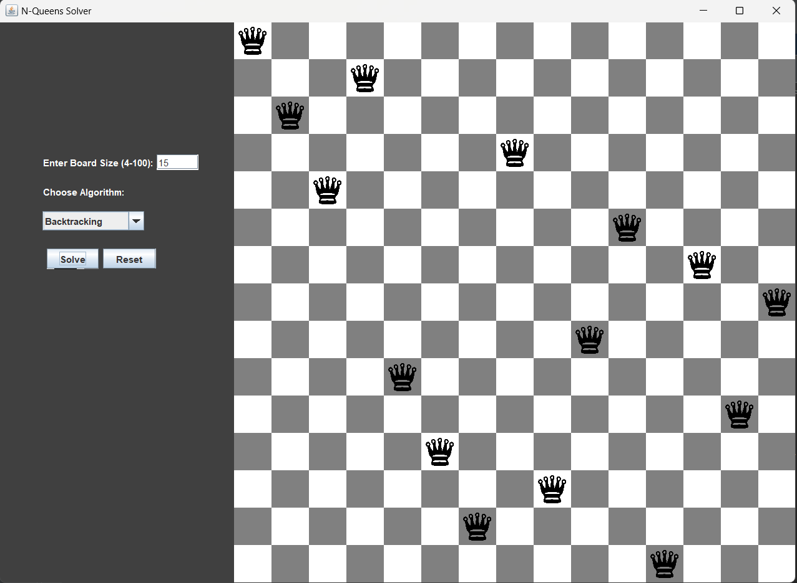
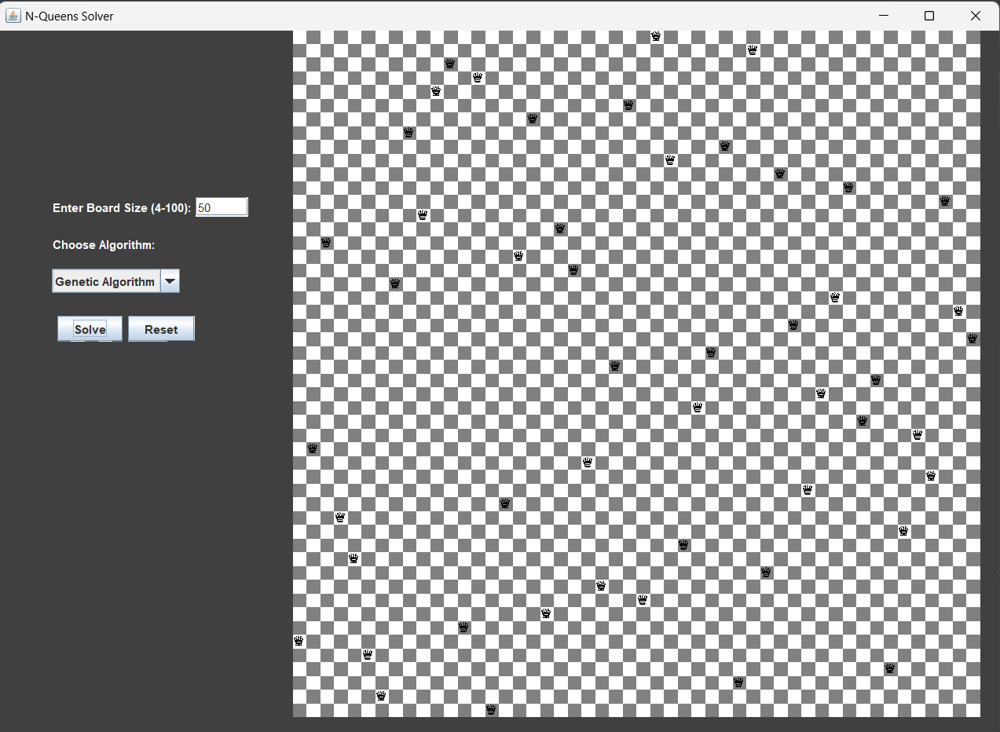
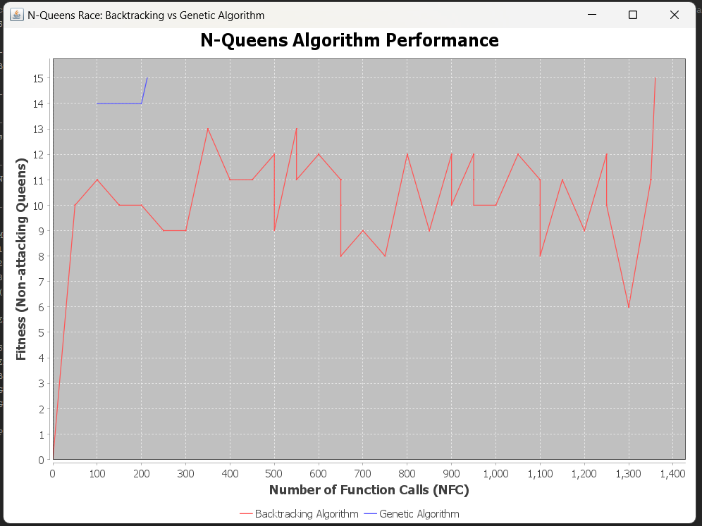
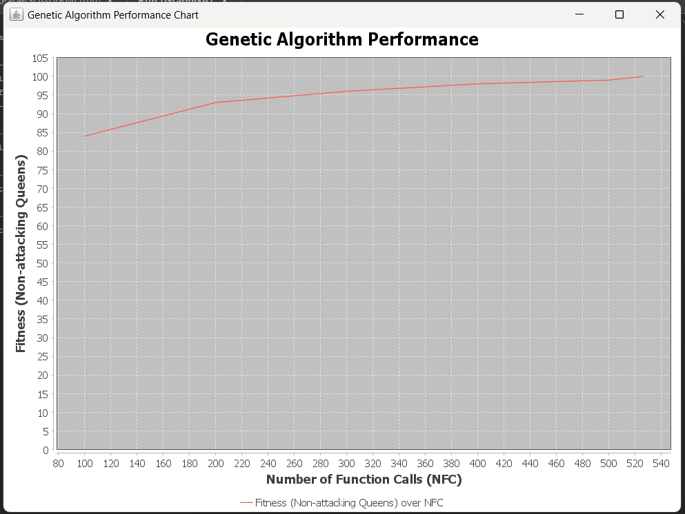

# CS214 Assignment Two

This project was developed in **Apache NetBeans 22** and is a **Maven project** that runs with **Java 22**.

## How to Run the Program:

1. **Unzip the Folder**:  
   Extract the provided zip file containing the project.

2. **Open the Project** in NetBeans:  
   Launch NetBeans and load the unzipped project into the IDE.

3. **Clean and Build with Dependencies**:  
   Make sure to clean the project and build it with all the necessary dependencies before running.

4. **Run the Main Java File**:  
   Execute the main file to start the program.

5. **Follow the Instructions in the Menu**:  
   The program will guide you through the menu options. Follow the on-screen instructions to proceed.

## Output Results:

- The output results are saved in the **`N-Queen-CS214/`** folder.
- Ensure that you open this folder in the directory where you saved the project files.

## Additional File:
- **`nqueens_EmphiricalResults.csv`** contains analysis of the algorithm for N = 50, however Back Tracking Algorithm crashed at N = 33.

---

## Screenshots:

- **Game GUI**  
  
  test

test
- **BT vs GA Analysis**  
  
  
- **Genetic Algorithm Analysis**  
  
